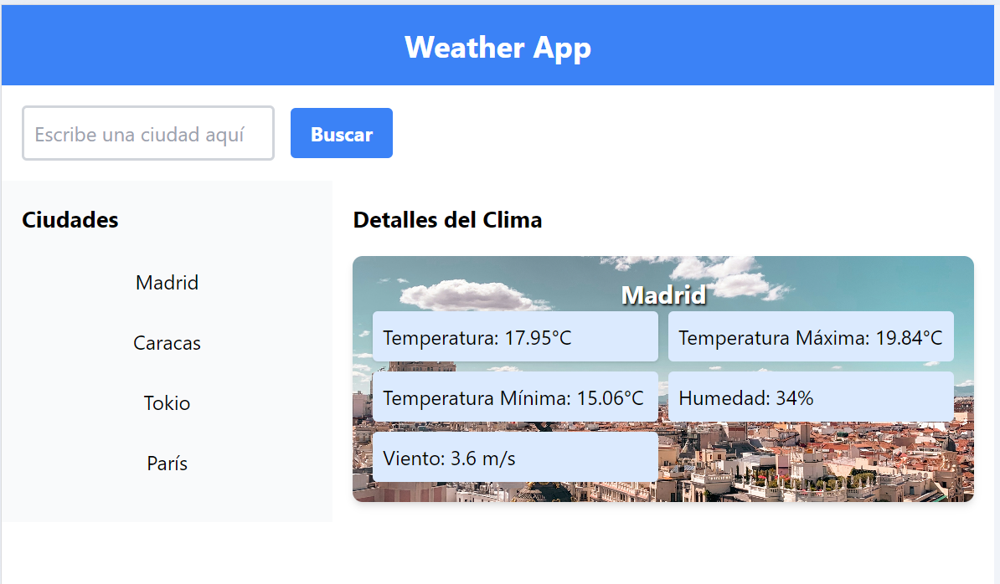

# ☀️ Weather App

Bienvenido a la **Weather App**, una aplicación web sencilla que proporciona información meteorológica en tiempo real para cualquier ciudad del mundo. Esta aplicación utiliza la API de OpenWeatherMap para mostrar datos como la temperatura, humedad y velocidad del viento.

## 🌟 Características

- **Consulta del clima en tiempo real**: Los usuarios pueden obtener el clima actual para cualquier ciudad que deseen. Esto se logra a través de dos métodos:
  - **Ciudades Predefinidas**: Selección rápida del clima actual en ciudades populares listadas directamente en la interfaz de usuario.
  - **Buscador de Ciudades**: Los usuarios pueden escribir el nombre de cualquier ciudad en el cuadro de búsqueda para obtener datos meteorológicos precisos en tiempo real.
- **Datos meteorológicos**: Muestra información detallada incluyendo temperatura, humedad y velocidad del viento.
- **Interfaz amigable**: Fácil de usar con un diseño claro y responsivo.

**Visualización de la web**:



## 🛠 Tecnologías Utilizadas

- **HTML**: Para estructurar la página.
- **CSS**: Para el diseño y estilo de la página, mejorado con **Tailwind CSS**, un framework de CSS que facilita la construcción de interfaces modernas y responsivas sin abandonar el diseño personalizado.
- **JavaScript**: Para la lógica de interacción con la API de OpenWeatherMap.
- **OpenWeatherMap API**: Provee los datos meteorológicos.

## 🚀 Cómo Usar

1. **Clona este repositorio** o descarga el código fuente.
2. **Regístrate en [OpenWeatherMap](https://openweathermap.org/) para obtener tu propia clave API** si deseas realizar tus propias solicitudes.
3. **Abre el archivo `index.html` en tu navegador** para empezar a utilizar la aplicación.

## 🔧 Configuración

Para que la aplicación funcione correctamente con tu propia clave API, deberás insertarla en el archivo `app.js`. Localiza la línea que contiene la variable `apiKey` y sustituye `'TU_CLAVE_DE_API'` con tu clave personal de OpenWeatherMap.

```javascript
const apiKey = 'TU_CLAVE_DE_API'; // Sustituye esto con tu clave de API real
```

## 🤝 Contribuir

¿Interesado en mejorar la Weather App? Tus contribuciones son bienvenidas. Sigue estos pasos:

1. **Crea un fork del repositorio.**
2. **Crea una rama para tu característica:** `git checkout -b feature/AmazingFeature`.
3. **Haz commit de tus cambios:** `git commit -m 'Add some AmazingFeature'`.
4. **Envía tus cambios a la rama:** `git push origin feature/AmazingFeature`.
5. **Abre un Pull Request.**

## 📄 Licencia

Este proyecto está licenciado bajo [CC-BY-4.0](https://creativecommons.org/licenses/by/4.0/deed.es)

## 🙋 Autor

- [CarPeAs](https://github.com/CarPeAs)- *Desarrollo inicial*

## 🎉 Agradecimientos

- Agradecimientos a todos los que han contribuido con ideas y soporte.